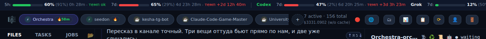
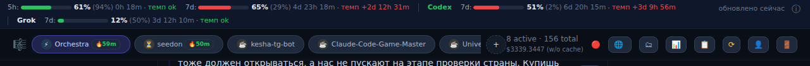

# #163 — usage-бар не режет кнопку графиков

## Диагноз

На живых данных `#usage-bar` занимал содержимым 1712 px независимо от viewport. Поэтому кнопка `#usage-info-btn` (`ⓘ`, открывает usage control со спарклайнами) имела правую координату 1700 px и была полностью за экраном при 1280, 1440 и 1680. Только при 1920 она становилась видимой.

Отдельная кнопка `#analytics-btn` (`📊`) в header во всех четырёх замерах оставалась в viewport. Жалоба относилась к правому краю верхнего usage-бара: это подтверждает и подсказка пользователя про `$5687 / 197 agents`, которые стояли непосредственно перед `ⓘ`.

## Решение

- Claude, Codex и Grok собраны в отдельные неделимые provider-группы. Бар переносит группу на следующую строку, а не режет её посередине.
- `ⓘ` и freshness закреплены отдельной правой группой и не сжимаются.
- Общая стоимость и число агентов убраны из постоянно видимой строки — пользователь прямо разрешил пожертвовать ими. Они не потеряны: обе цифры остаются внутри панели по `ⓘ`.
- На 1680/1920 бар остаётся однострочным (29 px). На 1280/1440 становится двухстрочным (46 px), сохраняя все лимиты и управление.
- На 390 px остаются видимы и `ⓘ`, и `📊`; горизонтального переполнения нет. Лимиты занимают несколько строк — это запасной, не основной сценарий задачи.

## Измерения

| viewport | до: `scrollWidth/clientWidth` | до: `ⓘ` | после: `scrollWidth/clientWidth` | после: `ⓘ` | высота после |
|---:|---:|:---:|---:|:---:|---:|
| 1280 | 1712 / 1280 | нет | 1280 / 1280 | да | 46 px |
| 1440 | 1712 / 1440 | нет | 1440 / 1440 | да | 46 px |
| 1680 | 1712 / 1680 | нет | 1680 / 1680 | да | 29 px |
| 1920 | 1920 / 1920 | да | 1920 / 1920 | да | 29 px |
| 390 | — | — | 390 / 390 | да | 108 px |

Сценарий: `docs/tasks/163/verify-topbar.py`. Он проверяет факт подмены branch-статики через новый runtime-символ `typeof _renderUsageBarShell`, видимость обеих кнопок и геометрию без горизонтального overflow.

## Тесты

- `tests/test_grok_usage_frontend.py`: новый тест прогоняет 1280/1440/1680/1920, требует Claude/Codex/Grok, видимый `ⓘ`, отсутствие overflow и отсутствие cost/agents в постоянной строке.
- Узкий прогон: `14 passed` (`test_grok_usage_frontend.py`, `test_quota_headroom_frontend.py`, `test_static_js_globals.py`).
- Мутация `flex-wrap: wrap → nowrap` покрасила новый тест: на 1280 `scrollWidth` снова стал 1400 при `clientWidth=1280`; после точечного отката тест снова зелёный.
- `node --check app/static/js/usage.js` и `git diff --check` — успешно.
