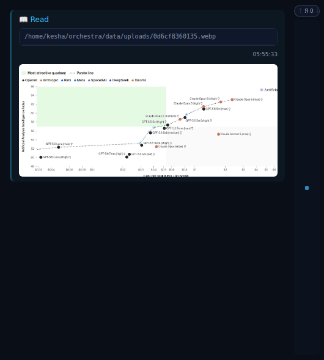

# #212 — восстановление картинок `Read` в истории чата

## Где ломалось

Проблема подтверждена в дашборде. В журнале оркестратора строка 71426 содержит присланный пользователем фрагмент с `Read /tmp/wedding-contact.jpg` и `🖼 [Image result]`; в journald есть реальный запрос браузера `GET /api/files/raw?path=%2Ftmp%2Fwedding-contact.jpg` с ответом 404. Самого `/tmp/wedding-contact.jpg` на диске уже нет.

Telegram-ветка не использует эту заглушку. После #189 она по-прежнему распознаёт парный `Read` image result и отправляет исходный файл через `_tg_send_file_safe(..., is_photo=True, important=True, isolated_preview=True)`. Удалённый в #189 `app/diff_image.py` отвечал за генерируемые текстовые превью, а не за эту прямую отправку фотографии. Три повторных прогона `TestReadImagePreview::test_read_image_uses_important_isolated_preview` прошли.

## Причина

Первичная история ограничивает содержимое строки 16 384 байтами. Начало результата ещё содержит `{'type': 'image'`, поэтому фронт входит в image-ветку, но закрывающая кавычка base64 уже срезана и inline-картинку извлечь нельзя. Раньше оставался только путь исходного `Read`; временный файл исчезал, `/api/files/raw` отвечал 404, а обработчик снова подставлял неполный thumbnail. Полная строка при этом остаётся доступна через уже существующий `GET /api/logs/{id}`.

На живых данных это воспроизведено строками `bench-effort`: tool 70425 читает `/home/kesha/orchestra/data/uploads/0d6cf8360135.webp`, tool result 70427 содержит полный base64 и соответствует реальному файлу размером 51 956 байт.

## Исправление

`_toolResultImageSrc` в одном месте извлекает base64 и настоящий `media_type`. При отсутствии пригодного inline payload чат сначала пробует исходный файл, а после его 404 запрашивает полную durable-строку `/api/logs/{id}`. Если ни один источник недоступен, вместо вечной обещающей загрузку заглушки отображается явное `🖼 Image unavailable`.

## Проверка

- `node --check app/static/js/app.js` — passed.
- `pytest tests/test_frontend.py tests/test_static_js_globals.py` — 33 passed.
- Новый браузерный тест вместе с TG-тестом — 2 passed, три раза подряд.
- Тот же браузерный тест отдельно доказывает два отказа: битый, но синтаксически полный inline-base64 не останавливает переход к durable-строке; битая картинка уже в durable-строке заканчивается `Image unavailable` без сломанного ``.
- Мутация, отключающая декодирование картинки из полной строки, красит новый тест по правильной причине: durable-строка запрошена, но картинка заменяется на `Image unavailable`.
- `docs/tasks/212/verify-read-image.py` подменяет только JS из worktree, ждёт новый runtime-символ, берёт реальную сохранённую картинку 1321×574, подаёт в чат её обрезанную 16 KiB строку и принудительно отвечает 404 на исходный путь. Результат: `naturalWidth=1321`, `naturalHeight=574`, заглушки нет, `/api/logs/70427` запрошен.
- Codex review: первый раунд нашёл оба случая с ошибкой декодирования; после исправления повторный раунд подтвердил `FIXED` для обоих, новых замечаний нет, verdict `APPROVED`. Полный протокол: [codex-review-impl.md](codex-review-impl.md).

