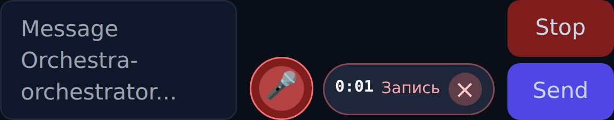

# #245 — голосовой ввод в дашборде

## Результат

Рядом с textarea появился круглый микрофон. Первый тап запрашивает микрофон и начинает запись, повторный — останавливает и запускает распознавание. Во время записи рядом видны таймер, состояние и отдельная кнопка `×`; она уничтожает запись локально, не вызывая сервер. Красный круг под микрофоном меняет масштаб по RMS громкости из `AnalyserNode`; цикл ограничен примерно 30 кадрами/с и переиспользует один буфер из 256 отсчётов.

После остановки браузер отправляет multipart на `POST /api/transcribe`. Возвращённый текст дописывается в `#chat-input`, оставляет курсор в конце и сохраняет draft. `sendChat` не вызывается: пользователь может поправить текст перед отправкой.

Кодек выбирается из поддерживаемых браузером вариантов через `MediaRecorder.isTypeSupported`: Opus/WebM для Chrome, AAC/MP4 или MP4 для Safari, затем Ogg fallback. При отсутствии поддерживаемого варианта используется собственный default `MediaRecorder`, а фактический `mimeType` передаётся серверу.

## Один Deepgram-владелец

Прежний `_transcribe_audio` и transcription cache вынесены из `app/tg_bridge.py` в `app/transcription.py`. Telegram импортирует эту же функцию; dashboard route вызывает её с фактическим MIME записи. Retry, parsing, cache и `voice_cost_add` остались в одном месте.

Сервер до Deepgram проверяет:

- допустимый browser audio MIME;
- размер не более 10 МБ;
- реальную длительность контейнера через `ffprobe`, не доверяя полю формы;
- конечность длительности (`NaN`/`Infinity` не обходят сравнение лимита);
- длительность не более 5 минут.

Пустая запись, неизвестный формат, отсутствие `DEEPGRAM_API_KEY`, upstream error и пустая транскрипция возвращают конкретную ошибку. Временный файл удаляется в `finally` при любом исходе.

## Проверка

- `tests/test_voice_input.py`: успешный MP4 upload, MIME/session/scope в общий клиент, cleanup tempfile; size/duration до Deepgram; upstream/format errors; отсутствующий key без сети; реальный WAV через `ffprobe`.
- `tests/test_tg_bridge.py::test_transcribe_audio_persists_voice_cost`: Telegram использует ровно функцию из общего модуля, транскрипция и cost ledger сохранены.
- `tests/test_frontend.py::test_mobile_voice_input_records_transcribes_and_cancels`: mobile context 390×844; Safari-only MP4 capability; запись, таймер, уровень, multipart upload, текст в textarea, отсутствие автоотправки, отмена без второго запроса, видимая permission error. Отложенное событие `stop` и синхронная попытка нового старта подтверждают single-flight записи.
- `docs/tasks/245/verify-voice-input.py`: на живой странице подменяет branch JS/CSS и ждёт `typeof initVoiceInput`; Chromium с настоящими `getUserMedia`, `MediaRecorder` и `AnalyserNode` на fake audio device записал Opus/WebM и отправил 17 349 байт multipart. Полученный текст оказался в textarea.
- Узкий итоговый прогон — 9 passed. Четыре точечных мутации дали ожидаемый RED и снова GREEN после отката: снятие верхнего лимита duration; снятие проверки `isfinite` (`NaN` дошёл до Deepgram и вернул 200); удаление полей FormData; снятие stop-lock (второй `getUserMedia` до события `stop`).

Codex-review прошёл два раунда. В первом найдены гонка stop/start и обход лимита через `NaN`; оба замечания подтверждены кодом, исправлены и закрыты мутациями. Во втором раунде Codex сам выполнил 7 focused tests и `node --check`, подтвердил оба фикса и выдал `APPROVED` без новых находок. Полный журнал: `codex-review-impl.md`.

## Эксплуатация

JS/CSS применяются без рестарта, но новый `/api/transcribe` живёт в Python router. После мержа нужен управляемый рестарт Orchestra; до него кнопка запишет звук, а сервер честно ответит 404 на распознавание.

`test_route_surface_snapshot` в этой ветке остаётся красным только по уже существующему `/api/fan/open`: снапшот не содержит маршрут #231. `/api/transcribe` в снапшот #245 добавлен и в diff теста больше не фигурирует.
