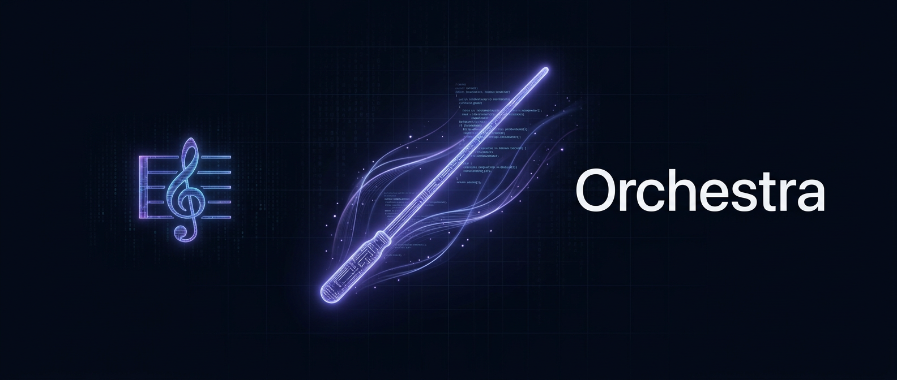

<p align="center">
  
</p>

# 🎼 Orchestra — AI Agent Orchestrator

**v2.3.0** | [Changelog](CHANGELOG.md)

Your own AI agent orchestrator. Opus orchestrator manages Sonnet/Haiku workers via MCP tools. Each worker in isolated git worktree. Dashboard + Telegram bridge for full visibility.

## Quick Start

```bash
cp .env.example .env  # edit tokens
uv sync
uv run uvicorn app.main:app --host 127.0.0.1 --port 8888
# Open http://localhost:8888
```

## How It Works

1. **Create an orchestrator** — pick a project, model. Pill button in header
2. **Chat with it** — give tasks, it spawns workers automatically
3. **Workers work** — isolated git worktree, own branch, MCP communication
4. **See everything** — real-time SSE logs, context %, cache hit rate
5. **Telegram** — optional TG bridge mirrors all activity to group topics

## Architecture

```
Dashboard (HTMX+SSE) ←→ FastAPI :8888 ←→ SessionManager
                                            ├── Orchestrators (Opus, per-project)
                                            │     └── spawn/send/list/kill workers
                                            ├── Workers (Sonnet/Haiku, per-task)
                                            │     └── send_message back to orchestrator
                                            └── Cross-project messaging
TG Bridge (aiogram) ←→ Orchestra API
                    ←→ Telegram group with topics per orchestrator

Kesha TG Bot ←→ inbox_server :18081 ←→ Orchestra (notify_kesha MCP tool)
```

## Features

- **Fresh client per turn** — SDK limitation workaround, no hangs
- **Auto-report** — workers that finish without send_message get force-reported
- **Message inject** — messages to running agents delivered instantly
- **Prompt hot-reload** — updated prompts injected on first turn after restart
- **Context tracking** — per-model limits (200k/1M), cache hit %, color bars
- **Image paste** — Ctrl+V upload with md5 dedup
- **Cross-project** — orchestrators talk to each other via list_orchestrators + send_message
- **Bug reports** — agents file bugs to BUGS.md via report_bug MCP tool
- **Restart button** — ⟳ in dashboard header (sudo systemctl)
- **Multi-repo** — tested with 5 sub-repos, worktree isolation per sub-repo

## Related

- [kesha-tg-bot](https://github.com/DrSeedon/kesha-tg-bot) — Telegram bot (personal AI assistant), integrates with Orchestra via inbox server + MCP tools

## Stack

- Python 3.12+, FastAPI, Jinja2, SSE
- `claude-agent-sdk` — Claude Code SDK
- SQLite (WAL mode), git worktrees
- Tailwind CSS, marked.js, DOMPurify (bundled offline)
- aiogram 3.x (TG bridge)
