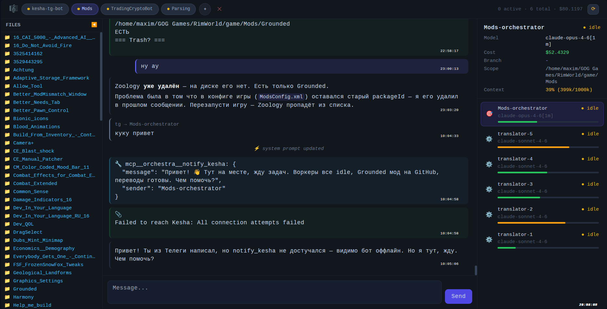

<p align="center">
  
</p>

<h1 align="center">Orchestra</h1>
<h3 align="center">Команда ИИ-агентов, которая думает как менеджер, а не как конечный автомат</h3>

<p align="center">
  <sub><a href="README.md">English</a> · <b>Русский</b></sub>
</p>

<p align="center">
  <a href="#quick-start">Быстрый старт</a> ·
  <a href="#how-it-works">Как это работает</a> ·
  <a href="#comparison">Сравнение</a> ·
  <a href="#features">Возможности</a> ·
  <a href="https://seedon.ru">Сайт</a> ·
  <a href="CHANGELOG.md">Changelog</a>
</p>

<p align="center">
  <a href="https://github.com/DrSeedon/orchestra/commits/main"></a>
  <a href="https://github.com/DrSeedon/orchestra/graphs/commit-activity"></a>
  <a href="https://github.com/DrSeedon/orchestra/stargazers"></a>
  <a href="LICENSE"></a>
  
  
</p>

---

**Orchestra — платформа оркестрации ИИ-агентов, где командой управляют так, как директор управляет компанией, а не так, как программист пишет пайплайн.**

Вы формулируете цель. Оркестратор сам делит её на задачи, поднимает нужных воркеров, отправляет их работу на ревью в модель другого вендора и мержит то, что прошло. Каждый воркер живёт в своём git worktree. Они пишут друг другу напрямую, а не через вас, и живут часами и днями, а не в пределах одного запроса к API.

Диспетчер здесь не вы. Что резать на задачи, кому какую отдать, когда звать ревью и что мержить — работа оркестратора, то есть агента, а не ваша. За вами остаются цель, те апрувы, которые вы решили оставить себе, и дашборд — заглянуть, когда захочется.

> **Рынок ИИ-агентов едет от SDK к продуктам.**
> 2024: «вот SDK, собери сам». 2025: «вот агент, дай ему задачу». 2026: «вот КОМАНДА, дай ей цель». Orchestra — третье.

<p align="center">
  
  <br>
  <em>Дашборд в реальном времени — 6 агентов параллельно на клиентском проекте</em>
</p>

<a id="quick-start"></a>
## Быстрый старт

**Нужно:** Python 3.12+, [uv](https://docs.astral.sh/uv/), Node.js 18+, [Claude Code CLI](https://docs.anthropic.com/en/docs/claude-code) (и подписка Claude Max к нему)

```bash
# Клонируем и ставим
git clone https://github.com/DrSeedon/orchestra.git
cd orchestra
cp .env.example .env
uv sync              # --extra rag добавит устаревшую векторную память, см. «Возможности»

# Запускаем
uv run uvicorn app.main:app --host 127.0.0.1 --port 8888

# Открываем http://localhost:8888
# Создаём оркестратора, указываем ему проект и начинаем разговаривать
```

Ни описаний графа, ни YAML-воркфлоу, ни настройки нод. С оркестратором разговаривают так же, как с тимлидом.

<a id="how-it-works"></a>
## Как это работает

```
Вы (Telegram / дашборд)
  │
  ▼
Оркестратор (Claude) ─── думает как менеджер
  │   Режет задачу, раздаёт воркерам, принимает результат
  │
  ├─► Воркер A ── git worktree: feature/auth
  ├─► Воркер B ── git worktree: feature/api
  ├─► Воркер C ── git worktree: fix/bug-123
  │
  ▼
Ревьюер (GPT) ── ревью моделью другого вендора
  │   Другая модель — другие слепые пятна
  │
  ▼
Мерж ── squash в main
```

Каждый воркер — полноценная агентская сессия в своём git worktree: Claude Code, Codex, Grok или собственный OpenRouter Harness, выбирается под воркера. Контекст у них не общий, по коду друг друга они не топчутся, в main попадают squash-коммитом. Оркестратор координирует. Это не графовый движок, а живой ИИ, который решает, что делать дальше.

Воркеры разговаривают друг с другом через `send_message`. Бэкендер дописал эндпоинт и пишет фронтендеру: «эндпоинт готов, `/api/users`, вот схема». Человек в этой цепочке не нужен.

<a id="comparison"></a>
## Что Orchestra умеет, чего не умеет и чего не будет делать

Таблицу, где автор побеждает в каждой строке, читать незачем. Здесь три статуса и ни одного прочерка — прочерк как раз прячет единственное интересное различие: *не смогли* против *решили не делать*:

**✅ работает сегодня** — с якорем, который можно проверить: `файл:строка`, команда или измеренное нами число ·
**🚧 частично или не принуждается кодом** — в строке написано, чего именно не хватает ·
**🚫 сознательно нет** — не делали вовсе либо сделали и убрали; причина в строке, и это не «не было времени».

| Возможность | | Якорь |
|---|---|---|
| Цель режет на задачи, поднимает воркеров, раздаёт и мержит агент, а не человек | ✅ | ролевой промпт оркестратора + `spawn_worker`/`merge_worker`; вы апрувите, но не диспетчеризуете |
| Воркер живёт дольше одного запроса | ✅ | 431 завершённая сессия воркера: медиана 0,8 ч, p90 **130,6 ч**, максимум 531,8 ч, 81 прожил больше суток |
| Переживают рестарт платформы; простаивающие воркеры засыпают и отпускают дерево процессов | ✅ | сессии в SQLite + авто-резюм, `app/session_hibernate.py` |
| Воркеры пишут друг другу напрямую, с надёжными квитанциями доставки | ✅ | `app/message_deliveries.py` |
| Воркер поднимает своих воркеров | 🚧 | Запрещено ролевым промптом воркера, но не кодом: у `spawn_worker` нет ролевого гейта, поэтому воркер, проигнорировавший инструкцию, всё ещё может его вызвать. Правило существует потому, что ребёнок правит те же файлы на второй ветке — два диффа встречаются на мерже, и один из них проигрывает, плюс появляется задача, которую никто не заказывал |
| Git worktree на воркера, squash-мерж в main | ✅ | `app/workspace.py` |
| Два воркера не могут владеть одним каталогом | ✅ | спавн отказывает при пересечении, `dirs_overlap` в `app/manager.py:596` |
| Потолок вставленных строк на мерже, с записываемым вейвером | ✅ | 2 000 строк, `MAX_DIFF_INSERTIONS` в `app/diff_budget.py:16` |
| Тесты, решающие судьбу мержа, запускает платформа, а не агент | ✅ | Сопоставленное подмножество тестов гейтит каждый мерж и блокирует и на падении, и на неопределённости (`gate_blocks`, `app/merge_operations.py:2063`). Замороженный приёмочный оракул пиннится и исполняется, когда он у задачи есть (`evaluate_pinned_oracle`, `app/acceptance.py:349`); когда его нет, мерж, трогающий `app/` или `tests/` не в main, отбивается целиком (`nested_behavioral`, `app/merge_operations.py:1051`) |
| Кросс-вендорное ревью как гейт мержа **на уровне кода** | ✅ | Принуждается на мерже с #462: раннер мержа блокируется по вердикту покрытия ревью (`review_coverage_policy_active`, `app/merge_operations.py:1908`) и отказывает с `RECORD_REVIEW_THEN_NEW_OPERATION`, когда под точный снимок нет квитанции (`app/merge_operations.py:609`). Политика включается маркером внутри скилла ревью и читается в рантайме (`policy_active`, `app/review_coverage.py:382`) — на 05.09.2026 включена. Известное ограничение: квитанция ищется по id сессии самого воркера, поэтому оркестратор не может заверить ревью за него |
| Апрув человека как машинно-проверяемое состояние | 🚧 | Живёт в чате и в блоке промпта `<approval-gate>`. Квитанции апрува в базе нет, и мерж её не спрашивает |
| Песочница вокруг команд, которые запускает агент | 🚧 | Worktree изолирует *файлы*, а не исполнение. Наш ревьюер работает с `-s danger-full-access -a never` (`app/mcp_stdio.py:4201`). Это то, с чем мы живём, а не ограничение машины: `cat /proc/sys/kernel/unprivileged_userns_clone` отвечает здесь `1`, просто бинарника песочницы под это не поставлено. Работы по изоляции не ведутся |
| Модели нескольких вендоров под одним контрактом рантайма | ✅ | 4 рантайма: CLI Claude Code, Codex и Grok плюс собственный внутрипроцессный OpenRouter Harness — `BUILTIN_RUNTIMES` в `app/runtime_registry.py:330` |
| Подключение нового CLI-агента конфигом | 🚫 | Каждый рантайм — написанный руками бэкенд, конфигом ничего не добавляется. У Orca, для сравнения, заявлен «any CLI agent» |
| Пишет модель одного вендора, ревьюит модель другого | ✅ | `codex_review`, `app/mcp_stdio.py:3987` — ревью поднимает CLI другого вендора |
| Квотный гейт, блокирующий воркеров у стены подписки | ✅ | `line_limit` в `app/quota_gate.py:115` |
| Тот же гейт на оркестраторах | 🚫 | Исключены намеренно (решение владельца, 03.09.2026): замолчавший оркестратор хуже перерасходовавшего |
| Платные маршруты во встроенном харнессе | 🚫 | Только точные `:free`, `app/harness/llm.py:167` |
| Бесплатные модели как рабочая лошадь | 🚫 | Замерено: 2 закрытых тикета из 30 (6,67 %), и 53 прогона из 60 упали на недоступности маршрута, а не на качестве (#422) |
| Grok поддерживается наравне с Claude и Codex | 🚫 | Заведён под одну узкую задачу и с тех пор не развивается. Он работает, но он не равный |
| Лексическая память проекта, которую агент обязан прочитать до работы | ✅ | `.orchestra/kb/`, один факт в строке и команда, которая его доказывает |
| Векторная / семантическая память | 🚫 | Сделали, замерили, убрали: на holdout из 18 вопросов по этому репозиторию у вектора **0 уникальных побед против 6 у обычного `rg`**. Реализация по-прежнему в коде и работает, если её включить (`--extra rag`, по умолчанию выключено) — просто мы на ней больше не строим |
| Корневой гид достаточно мал, чтобы быть оглавлением | 🚧 | Наше же правило; запустите `wc -c CLAUDE.md` и увидите файл, который давно перестал быть оглавлением: он меряется сотнями килобайт и продолжает расти. Зеркало для Codex обрезается посреди фразы по `project_doc_max_bytes`, поэтому часть правил до тех воркеров молча не доезжает (#323) |
| Дашборд (`dashboard.html` через `app/routes/system.py:77`) и управление из Telegram (`app/tg_bridge.py`) | ✅ | Голосовые расшифровываются Deepgram `nova-3`, `app/transcription.py:72` |
| Терминальный клиент, десктопное или мобильное приложение | 🚫 | Не делали: рабочее место — дашборд плюс Telegram. С телефона работают через Telegram, а не через приложение |
| Кеш истории чата на стороне браузера | 🚫 | Сделали и осознанно убрали: локальное зеркало не может доказать, что после его watermark ничего не появилось, поэтому оно способно показать устаревший кадр как свежий. `no-store` выставлен и на сервере (`app/routes/sessions.py:602`), и на клиенте (`app/static/js/app.js:1274`) |
| Установка одной командой, готовые бинарники, Docker-образ | 🚧 | `git clone` + `uv sync` + свои вендорские CLI и подписки. Как релизный артефакт не публикуется ничего |
| CI на каждый пуш, и зелёный | 🚧 | Workflow настоящий и запускается на каждый пуш и PR в `main` (`.github/workflows/ci.yml`), и он красный: на 05.09.2026 зелёным закончился меньше чем один прогон из ста. Причины две, и обе видны в логе последнего падения — он успел напечатать несколько десятков упавших тестов, после чего процесс убили по памяти с кодом 137 примерно на четырёх пятых пути. Полный сьют не переживает одного процесса и на нашей машине, поэтому судьбу мержа решает сопоставленное подмножество, которое платформа запускает сама (строка выше), а не этот workflow. Бейджа CI в шапке нет намеренно: красный бейдж говорит постороннему «проект сломан», а правда у́же |
| Стоячее разрешение или автоочередь задач | 🚫 | Каждая задача апрувится руками (решение владельца, 27.08.2026), чтобы не строилось то, чего не просили |

### А чем это отличается от субагентов?

Честный ответ: за 2026 год отличий стало меньше. Субагенты обзавелись своим контекстом, перепиской между собой, вложенностью и опциональным worktree. Не изменилось другое — кому принадлежит жизненный цикл и где проходит граница вендора. Цитаты ниже из документации самих вендоров, сверены **03.09.2026**.

| | **Orchestra** | **Субагенты Claude Code** | **Субагенты Codex** |
|---|---|---|---|
| Жизненный цикл принадлежит | строке в нашей базе — воркер переживает рестарты и гибернацию | родительскому диалогу: «Each subagent invocation creates a new instance rather than continuing an earlier one» | родительскому прогону: «Codex waits until all requested results are available, then returns a consolidated response» |
| Изоляция репозитория | worktree на воркера, всегда | опциональный `isolation: worktree`; по умолчанию «A subagent starts in the main conversation's current working directory» | «Subagents inherit your current sandbox policy» |
| Вендор модели | четыре рантайма: Anthropic, OpenAI, xAI, OpenRouter | `model`: «`sonnet`, `opus`, `haiku`, `fable`, a full model ID such as `claude-opus-5`, or `inherit`» | `gpt-5.6`, `gpt-5.6-terra`, `gpt-5.6-luna` |
| Ревью | модель другого вендора, гейт на мерже (строка ✅ выше) | «Spawn a teammate using the security-reviewer agent type» | «Review this branch with parallel subagents» |

Замер по нашей же базе, 02.09.2026: субагенты обоих видов прожили в нашем контуре медиану **12,5 с** (p90 75,1 с), и дольше десяти минут не прожил **ни один (0,0 %)**; у сессий воркеров p90 — **130,6 ч**. Это разница в природе, а не в длительности, и она режет в обе стороны. Субагент — один вызов инструмента внутри работающего процесса; воркер здесь стоит строки в базе, ветки и worktree, поэтому под «сходи прочитай двадцать файлов и вернись» вся эта машинерия не даёт ничего. Ещё субагенты из коробки вкладываются «up to three layers below the main conversation», а мы это запрещаем правилом.

### Лоб в лоб с Orca

Orca — ближайшее к нам из того, у чего есть настоящая аудитория, поэтому сравнение имеет смысл вести
строками, а не прилагательными. Всё, что стоит в их колонке, — цитата из их же README, вытянутого
сырым 05.09.2026 (`gh api repos/stablyai/orca/readme`); всё, что стоит в нашей, имеет якорь выше по
этой странице. Три строки из шести — их.

| | **Orchestra** | **Orca** |
|---|---|---|
| Кто режет работу и решает, что поедет в main | агент: оркестратор сам делит цель, поднимает воркеров и мержит прошедшее (`spawn_worker`/`merge_worker`) | вы: «Fan one prompt across five agents … compare the results and merge the winner». При этом их шапка называет продукт «The AI Orchestrator for 100x builders» |
| Сколько агентов можно подключить | четыре, и только написав бэкенд под каждого — `BUILTIN_RUNTIMES` в `app/runtime_registry.py:330`. **Эта строка их.** | «Works with **any CLI agent** — if it runs in a terminal, it runs in Orca», 29 названы логотипами |
| Как ставится и где им пользуются | `git clone` + `uv sync`, дальше веб-дашборд и телеграм-бот; как релизный артефакт не публикуется ничего. **Эта строка их.** | `brew install --cask`, `yay -S`, `.exe` под Windows, AppImage под Linux плюс приложение для iOS в App Store и APK под Android |
| Аудитория | один мейнтейнер, звёзд — двузначное число. **Эта строка их.** | десятки тысяч звёзд и тысячи форков, MIT, запушено в тот же день, когда мы это читали |
| Кто ревьюит результат | модель другого вендора, и мерж отказывает без квитанции на точный снимок (таблица выше) | их README описывает ревью человеком — «Drop comments on any diff line and ship them back to the agent». Ревьюит ли что-нибудь модель в Orca, мы не проверяли |
| Что с агентом между запусками | строка в SQLite: переживает рестарт, спит в простое, p90 130,6 ч | не проверяли — их README про время жизни агента не говорит, а молчание README не доказывает, что механизма нет |

Мы читали их README, а не сайт документации, поэтому две ячейки «не проверяли» остаются открытыми, а
не заполняются догадкой. То же касается гейтов мержа и того, кто внутри Orca решает, как делить
работу, за пределами процитированной фразы.

### Где мы отстаём

- **Задержка вызова инструмента.** Каждый вызов инструмента здесь — внешний процесс: замер на этой машине даёт 3 667,6 мкс против 20,2 мкс внутри процесса, из которых 2 170,0 мкс — сам `fork+exec`. У oh-my-pi тулинг вкомпилирован, и они пишут «No fork/exec on the hot path».
- **У агента нет ни LSP, ни отладчика** — наш читает файлы и зовёт `rg`.
- **Интерфейсы.** cmux, когда агент поднимает помощников, «turns them into native panes and splits instead of hidden background processes». У нас они строчки в веб-дашборде.
- **Зрелость.** Один мейнтейнер против проектов с десятками тысяч звёзд — у cmux было 26 737, когда мы смотрели 03.09.2026. На этой странице сравнивается архитектура, а не зрелость продукта.

<sub>Источники, сверены 03.09.2026 (метрики репозиториев — 05.09.2026): [субагенты Claude Code](https://code.claude.com/docs/en/sub-agents) ·
[agent teams](https://code.claude.com/docs/en/agent-teams) ·
[субагенты Codex](https://learn.chatgpt.com/docs/agent-configuration/subagents) ·
[Orca](https://github.com/stablyai/orca) · [cmux](https://github.com/manaflow-ai/cmux) ·
[oh-my-pi](https://github.com/can1357/oh-my-pi) — README вытянуты сырыми через `gh api`, счётчики звёзд через
`gh api repos/<owner>/<repo>`. Числа Orchestra — из базы основной установки, снято 02.09.2026, и из команд,
показанных в таблице. Там, где первоисточник конкурента на вопрос не отвечает, строки нет вовсе вместо догадки — так с
изоляцией и перепиской агентов у cmux; а там, где вопрос всё же стоило задать, в ячейке написано
«не проверяли», как дважды сделано по Orca.</sub>

<a id="features"></a>
## Возможности

### 🏗️ Постоянный парк агентов
Агенты живут часами и днями. Держат контекст между задачами, помнят прошлые решения, копят знание о проекте. Это не одноразовые функции.

### 🌳 Изоляция через git worktree
У каждого воркера свой git worktree — полная копия репозитория на своей ветке. Два воркера в одном проекте не редактируют одни и те же файлы. Конфликты мержа минимизируются структурно. `owned_dirs` на воркера + `check_conflict()` перед мержем = безопасная параллельная работа.

### 📱 Мост в Telegram
Управление командой с телефона. Голосовые, фото, документы: оркестратор расшифровывает голос (Deepgram Nova-3), понимает картинки, читает файлы. Статусы прилетают в топики группы.

### 🔀 Кросс-вендорное ревью
Код, написанный одной моделью (Claude), ревьюит другая (GPT). У разных моделей разные слепые пятна, и вторая точка зрения ловит то, что первая пропускает. С #462 это гейт на уровне кода: мерж без квитанции ревью на точный снимок отбивается — подробности в строке таблицы выше.

### 🏰 Иерархия: оркестратор → суб-оркестраторы → воркеры
На проект один оркестратор. Суб-оркестраторы ведут подкоманды. Воркеры делают работу. Межпроектная переписка позволяет оркестраторам договариваться через репозитории.

### 🔄 Написана сама собой
Orchestra-orchestrator — это агент, который разрабатывает Orchestra: воркеры пишут код платформы, на которой сами и работают, и этот раздел редактировал один из них.

Числа ниже — из базы основной установки, снято **02.09.2026**. Сессии, задачи и субагенты считаются за всё время; сообщения и ходы — за текущее окно логов, оно открывается 27.07.2026:

| | |
|---|---|
| Сессий агентов | **598** (577 воркеров, 21 оркестратор) |
| Фоновых задач и субагентов | **5 593** (из них 197 — поднятые субагенты, остальное — фоновые shell-команды) |
| Сообщений в логах | **250 877** |
| Ходов агентов | **7 047** |
| Задач в трекере | **781** в 19 проектах |

Ни одно из этих чисел не про параллельность: одновременно наблюдалось максимум 10 воркеров. Вторая установка работает на отдельном сервере и считается отдельно, к этим числам никогда не прибавляется: 469 сессий, 5 043 фоновых задачи и субагента (из них 18 — поднятые субагенты), 248 867 сообщений, 660 задач в 9 проектах.

### ⚙️ Модельная политика по ролям
Каждая роль объявляет свою модель в манифесте пайплайна, а новых воркеров оркестратор роутит по классу задачи и остатку квоты, а не по имени и не по привычке. Рантаймы смешиваются в пределах одной команды: Claude Code, Codex, Grok и собственный OpenRouter Harness работают воркерами под одним контрактом, поэтому задачу может написать модель одного вендора, а отревьюить — другого.

### 📋 Менеджер задач
Встроенные задачи с приоритетами, исполнителями и учётом оплаты. Агенты сами заводят, обновляют и закрывают. Внешний таск-трекер не нужен.

### 💾 Переживающие рестарт сессии
Агенты переживают перезапуск. Сессии лежат в SQLite и поднимаются на старте сами. Контекст компактится автоматически, когда заполняется. Воркер продолжает с того места, где остановился.

Простаивающий агент не стоит ничего: воркеры Claude и Codex засыпают по таймауту простоя, отпуская всё дерево процессов вместе с app-сервером и MCP-серверами, и на следующем сообщении поднимают тот же самый нативный тред. Спавн, переключение, мерж и удаление сериализованы одним локом на репозиторий, поэтому воркер никогда не публикуется полуготовым, а мерж не приезжает в уехавшую цель.

### 🐞 Надёжный инбокс багов
Агенты заводят баги платформы через `report_bug`. Отчёты ложатся в служебный каталог состояния вне всех git-чекаутов — одна неизменяемая запись на отчёт, публикуется атомарным переименованием, — поэтому баг, заведённый посреди задачи, физически не может испачкать worktree и заблокировать мержи. Непрочитанные поднимают баннер в дашборде.

### 🧠 Память проекта
Прежде чем начать, агент ищет в прошлой работе: документы задач, правила проекта, старые сообщения агентов. Поиск лексический — обычный `rg` по базе знаний, которая под это и написана: один факт в строке, точные пути, символы и команда-доказательство.

**Векторный путь объявлен устаревшим.** Гибридный поиск (fastembed + sqlite-vec, слитые через RRF, переиндексация на каждом мерже) остался в коде и работает у того, кто его включит (`uv sync --extra rag` + `RAG_ENABLED=true`), но по умолчанию он выключен, новая работа туда не идёт, и строить на нём мы не советуем. Причина — наш собственный A/B, а не вкусовщина: на holdout из 18 вопросов по этому репозиторию у вектора **0 уникальных побед против 6 у обычного `rg`**. С выключенным флагом ничего от ML не грузится, а `search_memory` в ответ выдаёт команду грепа, которую стоит запустить вместо него.

### 📊 Дашборд в реальном времени
HTMX + SSE: каждый агент, его статус, расход контекста, попадания в кеш, текущая задача и живые логи. Без поллинга и без обновления страницы.

История чата никогда не отдаётся из локального кеша. При выборе агента приезжает один свежий снимок, а живой поток продолжается строго после последнего id сообщения из этого снимка. Свежесть принуждается с обеих сторон — `Cache-Control: no-store` на сервере и `cache: 'no-store'` на клиенте, — а переключение агента отменяет предыдущий запрос, поэтому история одного агента не может протечь в окно другого.

## Реальные проекты на Orchestra

Это не демо, они работают в проде. Числа по самой Orchestra — на 02.09.2026, остальные — на 07.08.2026; часть проектов — закрытая клиентская работа, поэтому репозиториев в открытом доступе нет.

| Проект | Что делает | Масштаб |
|---------|-------------|-------|
| **Parsing** (клиент, Камчатка) | Импорт данных, дедупликация, генеалогический поиск | 166 млн записей в MySQL |
| **[Seedon](https://seedon.ru)** (наша компания) | Регистрация, бухгалтерия, юр. сопровождение, сайт, маркетинг, первый клиент | Операционка целиком |
| **[Кеша](https://github.com/DrSeedon/kesha-tg-bot)** | Личный телеграм-бот на Claude Agent SDK | 24/7 на VPS |
| **VPN-сервис** | Управление Marzban VLESS+Reality | Свой хостинг |
| **Моды RimWorld** | 70+ переводов модов, C# DLL | 2000+ строк текста |
| **Sensar** (медтех) | Протокол валидации ПО видеоларингоскопа | 36 пунктов проверки, 20 страниц |
| **Университет** | Магистерская, конспекты лекций, ML-дашборды | 45 страниц, 29 источников с DOI |
| **Сама Orchestra** | Саморазработка: воркеры пишут платформу, на которой работают | 598 сессий агентов, 197 поднятых субагентов (см. выше) |

## Архитектура

```
Дашборд (HTMX + SSE) ◄──► FastAPI :8888 ◄──► Менеджер сессий
                                                  │
                               ┌──────────────────┼──────────────────┐
                               ▼                  ▼                  ▼
                         Оркестратор A      Оркестратор B      Оркестратор C
                         (проект: сайт)     (проект: бот)      (проект: данные)
                           │                  │                  │
                      ┌────┼────┐         ┌───┼───┐          ┌──┼──┐
                      ▼    ▼    ▼         ▼   ▼   ▼          ▼  ▼  ▼
                     W1   W2   W3        W4  W5  W6         W7 W8 W9
                    (fe) (be) (seo)     (tg)(api)(db)      (импорт)(дедуп)(поиск)

Мост в TG (aiogram) ◄──► API Orchestra ◄──► группа Telegram (топик на агента)

SQLite (WAL) ── сессии, логи, задачи, оплаты, фоновые задачи, расход
Git worktree ── по одному на воркера, squash-мерж в main
Служебное состояние ── инбокс багов, лежит вне всех чекаутов
```

## Мост в Telegram

Всё зеркалится в группу Telegram с топиками. Пишете в TG — агенты получают. Отправляете голосовое — расшифровывается через Deepgram. Кидаете скриншот — агенты его видят.

```bash
# Добавить в .env
TG_BRIDGE_TOKEN=токен_бота
TG_BRIDGE_GROUP=id_группы
# Опционально: расшифровка голоса
DEEPGRAM_API_KEY=ключ
```

## Стек

- Python 3.12+, FastAPI, Jinja2, SSE
- `claude-agent-sdk` — SDK Claude Code (персистентный клиент на сессию)
- Рантаймы Codex и Grok под общим контрактом бэкенда (JSON-RPC поверх stdio), плюс внутрипроцессный OpenRouter Harness
- SQLite (режим WAL), git worktree
- fastembed + sqlite-vec — устаревшая векторная память, по умолчанию выключена (`--extra rag`)
- Tailwind CSS, highlight.js, marked.js (лежат локально, без CDN)
- aiogram 3.x (мост в Telegram)
- Deepgram Nova-3 (расшифровка голоса)

## Как поучаствовать

Контрибьюции приветствуются, правила — в [CONTRIBUTING.md](CONTRIBUTING.md).

Задачи для первого захода помечены `good-first-issue`.

## Лицензия

**AGPL-3.0** для открытого использования. Для бизнеса есть коммерческая лицензия.

В [LICENSE](LICENSE) лежит дословный текст AGPL-3.0 и ничего кроме него. Всё, что относится именно
к этому проекту — правообладатель, автор и коммерческая опция, снимающая обязательства AGPL, —
в [NOTICE](NOTICE). По коммерческой лицензии писать [@DrSeedon](https://t.me/DrSeedon).

---

<p align="center">
  <b>Orchestra</b> — хватит строить пайплайны, начните руководить командой
  <br>
  <a href="https://seedon.ru">seedon.ru</a> · <a href="https://t.me/DrSeedon">Telegram</a> · <a href="https://github.com/DrSeedon/orchestra">GitHub</a>
</p>
